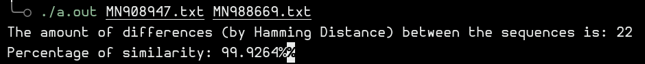

# week0-covid19 - Diego Linares

## Introduction

The purpose of the excercise was to find the similarity percentage between the genomes of different values, with the catch of not being O(n*m) in complexity (so no Levenstein allowed, technically). The program must receive as imput 2 `.txt` files and output the similarity percentage between those two.

## My approach

I decided to go with Hamming Distance (O(n) complexity) to compare the sequences. To make up for the fact that the sequences are not necessarily the same size, the smaller sequence is padded and shifted around in hopes of finding the best allignment possible (the shifts would add a constant to the complexity, which unless one string is empty, is still smaller than O(n*m)). 

The smallest of those Hamming Distances is used to obtain the similarity value of the sequences.

## Usage and screenshots.

To use the `sequenceComparison.cpp` it must be compiled and ran in the following form: 

`./a.out <filename1> <filename2>`

The output will be in terminal, showing the amount of differences between the sequences, and the similarity percentage between the two.

